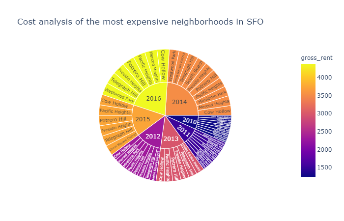

# Pyviz

This is an exercise to show the trends in the SFO Housing Market.

## Trends observed

*It can be observed that the yellow shaded pie has the highest gross rent in the $4,000 range*

*Interactive chart is available in the notebook. The size of the bubbles in the charts show sale price oer sqft (bigger bubble higher per sqft price). And the lighter color shows the higher rent for the properties*

### **Neighborhood Analysis:** 
Hvplot is used to create two interactive visulizations of average prices with a dropdown selector for the neighborhood. The first visualization is a line plot showing the trend of average price per square foot over time for each neighborhood. The second is a line plot showing the trend of average montly rent over time for each neighborhood.*(Interactive charts in the notebook)*

**Top 10 Most Expensive neighborhoods** Based on the sorted mean sale price per square foot for each neighborhood we can obtain the top 10 most expensive neighborhoods on average.

### **Cost to purchase vs. rental**
Hvplot to create an interactive visualization with a dropdown selector for each neighborhood. This visualization features a side-by-side comparison of average price per square foot versus average montly rent by year. (*Interactive chart in the notebook*)

